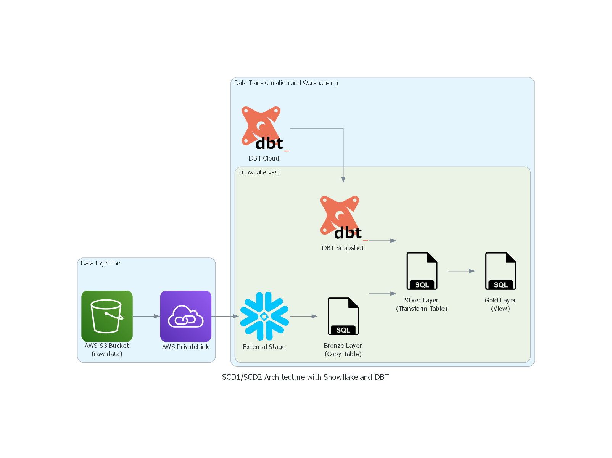

# 🧱 End-to-End Data Pipeline with SCD1 & SCD2 using DBT, AWS S3, and Snowflake

This project demonstrates an end-to-end modern data pipeline using **dbt** to ingest data from **AWS S3** into **Snowflake**, structured into **Bronze**, **Silver**, and **Gold** layers. It also includes support for both **Slowly Changing Dimension Type 1 (SCD1)** and **Type 2 (SCD2)** logic using **dbt snapshots and models**, a **dynamic Snowflake stored procedure** to infer and load schemas, and a **Python notebook** that produces charts and tables for analysis directly within Snowflake.

---

## 🧩 Architecture Overview



## 🧩 dbt Linage


1. **Raw File Drop**  
   - Source `.csv` files are uploaded into an S3 bucket.

2. **Ingestion via Stored Procedure**  
   - A Snowflake stored procedure dynamically infers the schema and loads raw data into the Bronze layer.

3. **DBT Layered Transformations**  
   - **Bronze Layer**: Raw ingested data from S3.  
   - **Silver Layer**: Cleaned and enriched data with SCD1 and SCD2 logic applied.  
   - **Gold Layer**: Curated views for analytics and dashboards.

4. **Data Lineage & Snapshots**  
   - dbt snapshots track history using SCD2 methodology.
   - Final views are exposed for reporting.

5. **Python Visualizations in Snowflake**  
   - Charts and tables are rendered using Snowflake Notebooks with Python.

---

## 🔧 Tech Stack

- **AWS S3** – Object store for source data files
- **Snowflake** – Data warehouse and procedural logic execution
- **DBT** – Modeling tool for transformation and versioning
- **Python** – Used in Snowflake notebooks for generating graphs and pivot tables
- **Snowflake Stored Procedures** – Dynamic schema inference and file load logic

---

## ⚙️ Stored Procedure: `LOAD_WALMART_DATA()`

A SQL stored procedure in the `BRONZE` schema dynamically ingests files staged in S3. It performs the following:

- Reads from a `control_table` to fetch filenames and MD5 hashes
- Uses `INFER_SCHEMA` to generate DDL if the table doesn’t exist
- Executes `COPY INTO` to load data
- Adds metadata columns (`ingestion_timestamp`, `source_file_name`)
- Logs the file as imported in `imported_files` to avoid duplicates

---

## 📂 Repository Structure
```
S3-SNOWFLAKE-using-dbt/
│
├── analyses/                         → Placeholder for ad-hoc analysis files
│
├── diagrams/
│   ├── architecture.png              → Visual diagram of the data pipeline
│   └── Diagram Generator/
│       └── architecture.py           → Python script to generate the architecture diagram
│
├── macros/                           → Custom SQL macros for automation
│   ├── 1_create_file_format.sql
│   ├── 2_create_AWS_stage.sql
│   ├── 3_create_control_table.sql
│   ├── 4_load_control_table.sql
│   ├── 5_create_tracking_table.sql
│   ├── 6_call_load_walmart_data.sql
│   └── generate_schema_name.sql
│
├── models/
│   ├── gold/                         → Final reporting views
│   │   ├── fuel_price_by_store_year.sql
│   │   ├── markdown_sales_year_store.sql
│   │   ├── schema.yml
│   │   ├── weekly_sales_breakdown.sql
│   │   ├── weekly_sales_by_cpi.sql
│   │   ├── weekly_sales_by_dept.sql
│   │   ├── weekly_sales_by_store.sql
│   │   ├── weekly_sales_by_store_size.sql
│   │   ├── weekly_sales_by_store_type.sql
│   │   ├── weekly_sales_by_store_type_month.sql
│   │   └── weekly_sales_by_tempature_year.sql
│
│   └── silver/                       → Cleaned and modeled transformation layer
│       ├── schema.yml
│       ├── stg_fact_table.sql
│       ├── Walmart_date_dim.sql
│       ├── Walmart_department_dim.sql
│       ├── Walmart_department_fact.sql
│       └── Walmart_store_dim.sql
│
├── seeds/                            → Optional seed files for reference or bootstrapping
│   └── .gitkeep
│
├── snapshots/
│   └── walmart/
│       └── walmart_fact_table.sql    → SCD2 snapshot definition for Walmart facts
│
├── snowflake/
│   ├── ExampleCharts/
│   │   └── ExampleCharts.pdf         → Sample output chart (PDF)
│   ├── notebook/
│   │   ├── Visualize_Walmart_Data.ipynb → Snowflake Python notebook for visualization
│   │   └── Visualize_Walmart_Data.md    → Markdown version of the notebook
│   └── StoredProcedure/
│       └── Load_Walmart_Data.sql     → Stored procedure to dynamically load files
│
├── tests/                            → Test artifacts or sample files
│   └── .gitkeep
│
├── .gitignore
├── dbt_project.yml                   → DBT configuration file
├── package-lock.yml
├── packages.yml                      → DBT package dependencies
└── README.md
```

---

## ▶️ How It Works

1. ☁️ **Upload Data**
   - Add `.csv` files to the S3 bucket (manually or automated).
   - Entries are logged in `control_table` with file name and MD5 hash.

2. ❄️ **Run Stored Procedure**
   - `CALL WALMART.BRONZE.LOAD_WALMART_DATA();`
   - Schema is inferred, table created (if not exists), and data loaded into Bronze layer.

3. 🧱 **Run DBT Models**
   - Use `dbt run` to transform data into Silver and Gold.
   - Use `dbt snapshot` to track historical changes (SCD2).

4. 📊 **Visualize in Notebooks**
   - Python code inside Snowflake Notebook generates charts and pivot tables from Gold views.

---

## 🔁 SCD Types

### 🔹 SCD1 (Overwrite)
- Implemented for attributes where history isn’t needed.
- Only current state is retained.

### 🔸 SCD2 (Track History)
- Implemented via `snapshots/` in dbt.
- Tracks changes by inserting new rows with:
  - `valid_from`
  - `valid_to`
  - `is_current` flag

---

## ✅ Highlights

- ✅ Modular ELT pipeline using dbt's layered architecture
- ✅ Dynamic table creation using `INFER_SCHEMA` in Snowflake SQL
- ✅ SCD1 + SCD2 implementation for real-world use cases
- ✅ End-to-end metadata logging using control and tracking tables
- ✅ Clean charts and tables using Snowflake Notebooks & Python

---

## 🏷️ Tags & Topics
```
Use these hashtags when sharing the project:
#DataEngineering #Snowflake #DBT #AWS #S3 #SCD1 #SCD2 #ETL #Snapshots #Notebooks #Analytics #CloudWarehouse
```

